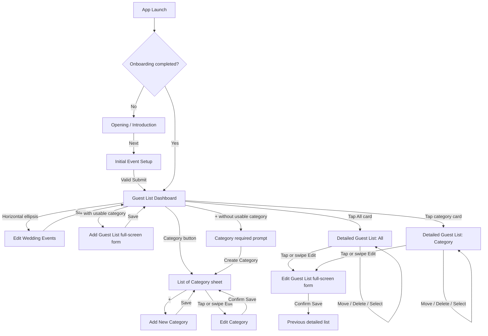
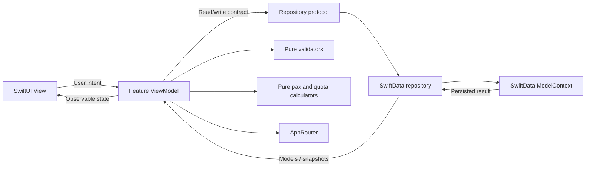
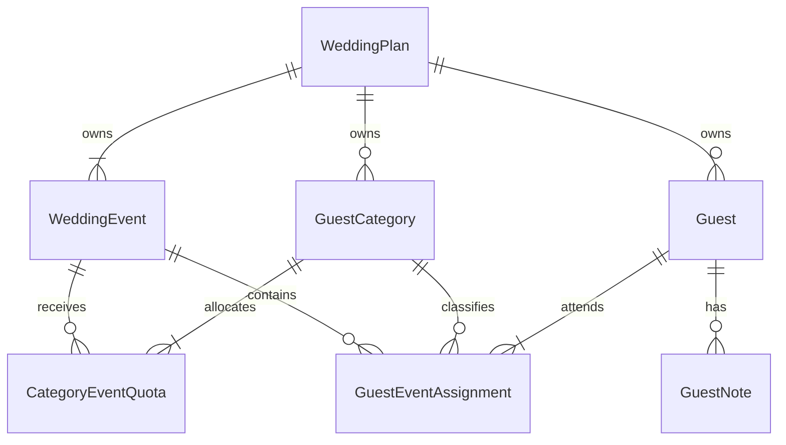

# Tamoe App Structure and Engineering Blueprint

- **Status:** Proposed v1 implementation blueprint
- **Last updated:** 2026-07-13
- **Proposed platform foundation:** iOS 26.5+, SwiftUI, SwiftData
- **Proposed architecture:** Feature-first MVVM with repository-backed persistence

## 1. Document Purpose and Authority

This document is the implementation source of truth for Tamoe's first release. It translates the product description into a screen specification, domain model, folder structure, architectural contract, and acceptance checklist.

The existing prototype screenshots are non-normative visual references. They may guide general layout and interaction familiarity, but they must not introduce fields, labels, screens, or behavior that conflict with this document. When the screenshots and the written requirements differ, this document wins.

The repository is currently an early SwiftUI shell. Every type and path described below is proposed unless it already exists in the project. This blueprint does not claim that the listed models, repositories, ViewModels, or components have already been implemented.

## 2. Project Context

### 2.1 Product description

Tamoe is a wedding guest-list planning app for couples who need to divide a limited number of pax across several wedding events, guest categories, priority levels, and households.

Instead of maintaining separate notes or spreadsheets for a ceremony, reception, and cultural events, users create one guest record and assign that guest to one or more events. Each event assignment has its own category, priority, and household size. Tamoe then shows how actual invited pax compare with event capacity and category allocations.

### 2.2 Target users

The primary users are couples planning a wedding with:

- One to five wedding events.
- A fixed pax capacity for each event.
- Guest groups such as Bride, Groom, Family, Friends, or Work.
- Difficult prioritization decisions between Must-Invite, Maybe, and Optional guests.
- Guests who may attend different combinations of events or bring different household sizes to each event.

### 2.3 Problem statement

Wedding guest planning becomes difficult when one person may attend several events, each event has a different capacity, and families need to divide allocations fairly. Generic note-taking and spreadsheet tools make it easy to duplicate guests, lose track of household sizes, or exceed an event or category quota without noticing.

### 2.4 Value proposition

Tamoe gives couples one event-aware guest database with:

- Separate capacities for every wedding event.
- Per-event category allocations.
- Per-event priority and household size for every guest.
- Immediate quota, remaining-pax, and overflow feedback.
- Focused tools for moving, editing, filtering, and removing guests.

### 2.5 v1 scope

The first release includes:

- One local wedding plan.
- A first-launch introduction and event setup flow.
- Up to five editable event slots.
- Event-specific pax capacities.
- Categories with allocations across selected events.
- Guest records with contact information and bulleted notes.
- Event-specific category, priority, and household size assignments.
- Dashboard allocation and actual-pax summaries.
- Detailed guest lists, priority filters, swipe actions, and bulk actions.
- Local persistence with SwiftData.

### 2.6 Explicitly out of scope for v1

- User accounts, authentication, or multiple user profiles.
- Multiple wedding plans.
- iCloud, CloudKit, or cross-device synchronization.
- Real-time collaboration or shared editing.
- RSVP status, invitation delivery, check-in, seating plans, or vendor management.
- Import/export, contact syncing, analytics, or remote notifications.
- Backend services or network-dependent features.

## 3. Product Language and Core Concepts

| Term | Definition |
|---|---|
| Wedding plan | The single local planning workspace managed by Tamoe. |
| Event slot | One of exactly five editable setup rows. A slot can be active or inactive. |
| Active event | A checked event that appears in the dashboard event selector and guest forms. |
| Capacity | The maximum planned pax for an event. Actual invited pax may exceed it and trigger a warning. |
| Category | A user-defined guest group that can be enabled for one or more active events. |
| Category quota | The number of pax allocated to one category for one event. |
| Guest | One person or household contact with a global name, phone number, address, and notes. |
| Event assignment | The guest's attendance configuration for one event: category, priority, and household size. |
| Household size | The number of pax represented by a guest record in one specific event. |
| Priority | One of `Must-Invite`, `Maybe`, or `Optional`. |
| All | All guest assignments for the currently selected event, never all events combined. |

Use **pax** for capacities, quotas, household counts, totals, and warnings throughout the app. Do not alternate between pax, guests, people, or seats in numerical UI labels.

## 4. Locked Product Rules

### 4.1 Events

1. Tamoe persists exactly five event slots for the wedding plan.
2. Slot 1 starts named `Holy Matrimony / Akad`; slot 2 starts named `Reception`; slots 3-5 start blank.
3. All five event names are editable, including the two defaults.
4. The two named defaults start unchecked.
5. Initial setup requires at least one active event.
6. Every active event requires a trimmed, nonblank, case-insensitively unique name and a positive integer capacity.
7. Inactive slots may be blank and do not require a capacity.
8. Event identity is stable. Renaming an event updates its display name without breaking category quotas or guest assignments.
9. An event cannot be deactivated while it has category allocations or guest assignments.
10. An event capacity cannot be reduced below the sum of its category quotas.
11. An event capacity may be reduced below its actual invited pax. The app saves the change and shows an over-capacity warning.
12. The dashboard displays one segment per active event and no `All Events` segment.

### 4.2 Categories and allocations

1. Category names are trimmed, nonblank, and case-insensitively unique within the wedding plan.
2. A category must be enabled for at least one active event.
3. Enabling a category for an event requires a positive integer quota.
4. One category's event quota cannot exceed that event's capacity.
5. The sum of all category quotas for an event cannot exceed the event's capacity.
6. A category is available in a guest's category picker only when that category has a quota for the selected event.
7. A category-event link cannot be removed while guest assignments use that category in that event.
8. A category cannot be deleted while any guest assignment uses it. The user must move or remove those assignments first.
9. A category quota may be reduced below the category's actual assigned pax. This is a soft over-quota state, not a validation failure.
10. Creating a category saves immediately after validation. Editing or deleting a category requires confirmation.

### 4.3 Guests and assignments

1. A guest requires a trimmed, nonblank name and at least one event assignment.
2. Phone number, address, and notes are optional global guest information.
3. Each guest can have at most one assignment per event.
4. Every assignment requires an active event, a category available for that event, a priority, and a household size of at least 1 pax.
5. A guest may have a different category, priority, and household size in every event.
6. Saving a guest is allowed even when the resulting actual pax exceed a category quota or event capacity.
7. The first save of a new guest does not require confirmation.
8. Committing edits to an existing guest requires confirmation when values changed.
9. Removing a guest from a detailed list removes only the assignment for the current event.
10. When a guest loses their final event assignment, the global guest record and its notes are deleted automatically.
11. Move and bulk Move change only the current event's category assignment.
12. Single and bulk Move/Delete operations require confirmation.

### 4.4 Onboarding and returning launches

1. The introduction and initial event setup appear until valid setup is submitted successfully.
2. Completing setup persists `hasCompletedOnboarding = true` in the wedding plan.
3. Later launches open the Guest List Dashboard directly.
4. Event settings remain available from the dashboard's horizontal ellipsis button.

## 5. Navigation and Presentation

### 5.1 Navigation map



### 5.2 Presentation contract

| Destination | Presentation | Dismissal/navigation |
|---|---|---|
| Opening | Root content before onboarding completion | `Next` advances to setup. |
| Initial Event Setup | Root onboarding destination | Valid `Submit` replaces onboarding with dashboard. |
| Guest List Dashboard | Main root destination | No back button. |
| Edit Wedding Events | Navigation push from dashboard | Back returns without committing; Save returns after validation. |
| List of Category | Modal sheet containing its own `NavigationStack` | Leading `X` dismisses the sheet. |
| Add/Edit Category | Push inside the category sheet | Back returns to category list; save returns after success. |
| Add/Edit Guest List | Full-screen modal form | Leading `X` discards the draft and dismisses. |
| Detailed Guest List | Navigation push from dashboard | Back returns to the selected event dashboard. |
| Move destination | Menu or compact chooser over the detailed list | Choosing a destination opens a confirmation alert. |
| Confirmation | System alert or confirmation dialog | Cancel leaves persisted data unchanged. |

`AppRouter` owns main navigation, sheets, and full-screen covers. The category sheet may own a small nested path for Add/Edit Category so feature-internal pushes do not leak into the root navigation path.

## 6. Screen Specifications

### 6.1 Opening / Introduction

**Purpose:** Briefly explain why Tamoe is needed before asking the user for setup data.

**Content:**

- Short opening statement about the difficulty of organizing wedding guests across events and quotas.
- Concise product explanation.
- Bottom `Next` button.

**Behavior:**

- Appears only before onboarding is completed.
- `Next` opens Initial Event Setup.
- Contains no editable data and no validation.

### 6.2 Initial Event Setup

**Purpose:** Select the wedding events Tamoe will manage and define each event's capacity.

**Content:**

- Setup title and short instructions.
- Five event rows in fixed slot order.
- Each row contains an activation checkbox, editable event name, and pax capacity field.
- Bottom `Submit` button.

**Initial state:**

| Slot | Initial name | Active | Initial capacity |
|---|---|---:|---|
| 1 | Holy Matrimony / Akad | No | Empty |
| 2 | Reception | No | Empty |
| 3 | Empty | No | Empty |
| 4 | Empty | No | Empty |
| 5 | Empty | No | Empty |

**Input behavior:**

- Event name uses the normal text keyboard.
- Pax capacity uses the number pad.
- Numeric text is converted to `Int` only after trimming and validation; invalid or overflowing input is rejected safely.

**Validation:**

- At least one row must be active.
- Every active row needs a unique nonblank name and capacity greater than zero.
- Inactive blank rows are valid.
- Errors appear inline beside the affected row and in an accessible summary near Submit.
- Submit remains disabled or refuses submission while validation errors exist.

**Success:**

- Persist all five slots, mark onboarding complete, select the first active slot by `slotIndex`, and replace the setup flow with the dashboard.

### 6.3 Guest List Dashboard

**Purpose:** Show capacity, allocations, actual pax, priorities, and categories for one selected event.

**Header and event selection:**

- Top-left title: `Guest List`.
- Top-right horizontal ellipsis button opens Edit Wedding Events.
- A horizontally scrollable segmented control shows every active event in slot order.
- Changing the event refreshes every card and metric below it.
- The selected event is stored by stable event ID, not array index or name.

**All card:**

- Title: `All`.
- Top-right total: `{actualPax}/{capacityPax} pax`, initially `0/{capacityPax} pax`.
- Concentric allocation chart:
  - Outer ring: category quota allocation by category color.
  - Neutral outer segment: capacity not allocated to any category.
  - Inner ring: actual household pax assigned to each category using the same colors.
  - Neutral inner segment: remaining event capacity while actual pax are below capacity.
  - When actual pax exceed capacity, the inner ring is visually capped at a full circle while the numeric overflow and warning communicate the excess.
- Overall progress bar based on actual pax divided by event capacity.
- Priority totals for Must-Invite, Maybe, and Optional, measured in pax.
- Tapping the card opens Detailed Guest List with `.all` scope for the selected event.

**Category section:**

- Shows only categories enabled for the selected event.
- Each card shows category name, actual/category quota pax, progress, priority totals, and an overflow warning when necessary.
- Tapping a category card opens Detailed Guest List with that category scope.
- When no category is enabled for the event, show an empty state explaining that categories are required before guests can be assigned.

**Floating actions:**

- `Category` opens List of Category.
- `+` opens Add Guest List when at least one active event has a usable category.
- If no active event has a usable category, `+` shows a Category Required prompt with Cancel and Create Category actions.
- Inside Add Guest List, an individual event without a usable category cannot be enabled; attempting to enable it offers a route to create a category.

**Warnings:**

- Event and category overflow are allowed.
- Overflow uses a warning icon, explicit text or pax value, and red styling. Color must not be the only indicator.

### 6.4 Edit Wedding Events

**Purpose:** Rename events, change capacities, and change which event slots are active after onboarding.

**Content and keyboards:**

- Reuses the five-row event editor with settings-specific title and supporting copy.
- Event names use the normal keyboard; pax capacity uses the number pad.

**Rules:**

- At least one event must remain active.
- Active names remain unique and nonblank.
- A populated event cannot be deactivated. `TamoeError.eventInUse` explains whether category allocations, guest assignments, or both must be removed first.
- Capacity cannot fall below combined category quotas.
- Capacity may fall below actual pax; save succeeds and dashboard warning state appears.
- Renaming preserves the event ID and all relationships.
- Deactivating an unused event hides it from the dashboard and guest forms but preserves its slot and editable name.
- If the currently selected dashboard event is deactivated, the dashboard selects the first remaining active event in slot order.

**Save behavior:**

- Save validates and commits the complete five-slot draft atomically.
- No special confirmation is required for ordinary valid settings changes.
- Validation failures do not partially update the stored slots.

### 6.5 List of Category

**Purpose:** Manage every category in the wedding plan.

**Presentation and content:**

- Modal sheet with a leading `X`, centered `List of Category` title, and trailing `+`.
- The list contains every category, including categories not enabled for the event that happened to be selected when the sheet opened.
- Empty state text: `Add Category`, with a clear explanation and the same trailing `+` action.

**Row actions:**

- Tapping a row pushes Edit Category.
- A left swipe reveals trailing Edit and Delete actions.
- Edit pushes the same prefilled form as a direct tap.
- Delete first checks whether the category is in use.
  - If in use, show a blocking explanation and do not offer destructive confirmation.
  - If empty, show a Cancel/Delete confirmation and delete only after confirmation.

### 6.6 Add New Category and Edit Category

**Shared form content:**

- Category name field at the top.
- One row for every active event, ordered by event slot.
- Each event row contains a checkbox, read-only event name, and editable pax quota.
- Category name uses the normal keyboard; pax quota uses the number pad.

**Add mode:**

- Title: `Add New Category`.
- Top-right arrow-up button validates and saves immediately without confirmation.

**Edit mode:**

- Title: `Edit Category`.
- Existing name, event selections, and quotas are prefilled.
- Top-right checkmark validates, then asks whether to save the changes when the draft differs from persisted data.
- If nothing changed, no confirmation or write is needed.

**Validation:**

- Name is required and unique, excluding the category being edited.
- At least one active event must be selected.
- Every selected event needs a positive quota.
- Each quota must be less than or equal to its event capacity.
- For each event, the total of all category quotas, replacing the edited category's old quota with its draft value, must not exceed event capacity.
- An event cannot be unchecked for the category while assignments use that category-event pair.
- Reducing a quota below actual assigned pax is allowed and produces an over-quota state after save.

### 6.7 Add Guest List and Edit Guest List

**Purpose:** Create or edit a global guest and their per-event attendance assignments.

**Form order:** Guest Name -> all active event sections -> Phone Number -> Address -> Notes. This order follows the written product requirement and is not changed by the grouping used in the data model.

**Global fields:**

- Guest name: required, normal text keyboard.
- Phone number: optional, phone/number keypad.
- Address: optional, normal text keyboard.
- Notes: optional ordered bullet items. Empty bullet items are not persisted.

**Event sections:**

- Show every active event in slot order with an attendance toggle.
- An event without at least one available category cannot be enabled. Tapping its disabled state explains why and offers Create Category.
- Enabling an event reveals:
  - Category menu filtered to categories enabled for that event.
  - Priority menu with `Must-Invite`, `Maybe`, and `Optional`.
  - Household Size stepper with a minimum of 1 pax.
- Category, priority, and household size belong to that event assignment and may differ between events.

**Add mode:**

- Title: `Add Guest List`.
- Leading `X` discards the draft.
- Top-right arrow-up validates and saves without confirmation.

**Edit mode:**

- Title: `Edit Guest List`.
- The complete global guest and all active-event assignments are prefilled.
- Leading `X` discards the draft.
- Top-right checkmark validates and asks whether to save when values changed.
- Turning off an event in the draft stages removal of only that assignment.
- At least one event must remain enabled when saving.

**Overflow behavior:**

- The form may warn that a change will exceed a category quota or event capacity, but this warning does not block saving.
- After save, dashboard and detailed-list totals update from the stored household sizes.

### 6.8 Detailed Guest List

**Purpose:** Browse and act on guests for one event, either across all categories or inside one category.

**Context:**

- The list is always scoped to one stable event ID.
- `.all` scope includes every assignment in the event.
- `.category(categoryID)` scope includes only assignments for that category in the event.

**Header:**

- Top-left back button.
- Top-right `Select` button; it changes to `Done` in selection mode.
- Page title: `All` or the category name selected on the dashboard.
- Small event-name subtitle below the page title.
- Right-side pax value:
  - All scope: actual event pax/event capacity.
  - Category scope: actual category pax/category quota.
- When actual pax exceed the relevant capacity or quota, show a warning icon and red value.

**Priority filter:**

- `All`
- `Must-Invite`
- `Maybe`
- `Optional`

The filter operates only inside the current event and list scope. Totals and cards are sorted and filtered from event assignments, not global guest fields.

**Guest card:**

- Guest name.
- Category name.
- Event-specific household size, formatted as `{value} pax`.
- Event-specific priority.
- No relationship field is included in v1 because it is not part of the written product model.

**Single-row interactions:**

- Tap opens Edit Guest List.
- Swipe Edit opens Edit Guest List.
- Swipe Move opens categories enabled for the current event, excluding the current category when possible. Confirmation is required before committing.
- Swipe Delete asks for confirmation, then removes only the current event assignment.
- If the removed assignment was the guest's last assignment, delete the global guest and notes in the same transaction.

**Selection mode:**

- Cards shift right and display leading checkboxes, following the familiar Mail selection pattern.
- The current priority filter remains visible; only visible filtered rows can be selected.
- Changing the priority filter clears the current selection to avoid acting on hidden guests.
- Bulk Move is enabled only when at least one row is selected and a valid destination category exists.
- Bulk Delete is enabled only when at least one row is selected.
- Bulk Move and Delete require confirmation and affect only current-event assignments.
- A successful action clears selection and refreshes or dismisses empty category results as appropriate.

**Empty states:**

- No guests in scope: explain that no guests have been assigned yet.
- No results for a priority: explain that the selected filter has no matching guests.
- No move destination: explain that another category must be created or enabled for this event.

## 7. Technical Foundation

### 7.1 Architecture overview

The proposed implementation uses feature-first MVVM:



Responsibilities are separated as follows:

- **Views** render state and send user intent. They do not mutate SwiftData directly.
- **ViewModels** own drafts, loading states, validation messages, confirmation state, filtering, and routing intent.
- **Repository protocols** define persistence operations in terms of stable IDs and feature drafts.
- **SwiftData repositories** perform fetches and atomic writes through `ModelContext`.
- **Validators** enforce hard business rules without UI or persistence dependencies.
- **Calculators** derive pax totals, allocation segments, progress, and overflow without side effects.
- **AppRouter** owns root navigation and modal presentation.

All UI-facing ViewModels and SwiftData repositories are `@MainActor`. Pure validators and calculators remain value types with static or instance functions and can be unit-tested without a model container.

### 7.2 Dependency construction

The implementation will update `TamoeApp` to create the SwiftData `ModelContainer` and one `AppContainer`, then launch `RootView`. `AppContainer` constructs repository implementations and injects protocol-typed dependencies into feature ViewModels. Views receive ViewModels or factories through initializers/environment values rather than creating repositories themselves.

The app must support an in-memory `ModelContainer` configuration for previews and tests.

### 7.3 Data flow and transaction boundary

1. A ViewModel loads persisted data into an immutable display snapshot or editable draft.
2. The user edits only the draft.
3. A pure validator returns field-level errors and, if valid, a normalized draft.
4. Confirmation-required actions wait without changing persistence.
5. The repository resolves stable IDs, rechecks invariants against current stored data, performs the whole mutation, and calls `ModelContext.save()` once.
6. On success, the ViewModel reloads its snapshot and dismisses or routes as appropriate.
7. On failure, persisted data remains unchanged and the ViewModel exposes a recoverable error message.

Bulk moves, bulk deletes, event setup, and multi-event guest saves are atomic operations. Partial success is not permitted.

## 8. Proposed Folder Structure

The main tree below is relative to the existing app-target source directory at `Tamoe/Tamoe/`. During implementation, the existing `TamoeApp.swift` moves into `App/`, `Assets.xcassets` moves into `Resources/`, and `TamoeApp` launches `RootView` instead of the starter `ContentView`. These are future implementation steps; creating this blueprint does not move or edit those files.

```text
Tamoe/
├── App/
│   ├── TamoeApp.swift
│   ├── AppContainer.swift
│   ├── AppRouter.swift
│   ├── AppRoute.swift
│   └── RootView.swift
├── Core/
│   ├── Domain/
│   │   ├── PriorityLevel.swift
│   │   ├── GuestListScope.swift
│   │   ├── DashboardMetrics.swift
│   │   └── TamoeError.swift
│   ├── Repositories/
│   │   ├── WeddingPlanRepository.swift
│   │   ├── EventRepository.swift
│   │   ├── CategoryRepository.swift
│   │   └── GuestRepository.swift
│   ├── Validation/
│   │   ├── EventSetupValidator.swift
│   │   ├── CategoryValidator.swift
│   │   └── GuestValidator.swift
│   ├── Calculations/
│   │   ├── PaxCalculator.swift
│   │   └── DashboardMetricsCalculator.swift
│   └── Extensions/
│       └── String+NormalizedInput.swift
├── Data/
│   ├── Models/
│   │   ├── WeddingPlan.swift
│   │   ├── WeddingEvent.swift
│   │   ├── GuestCategory.swift
│   │   ├── CategoryEventQuota.swift
│   │   ├── Guest.swift
│   │   ├── GuestEventAssignment.swift
│   │   └── GuestNote.swift
│   ├── Persistence/
│   │   ├── TamoeSchemaV1.swift
│   │   ├── TamoeMigrationPlan.swift
│   │   └── ModelContainerFactory.swift
│   ├── Repositories/
│   │   ├── SwiftDataWeddingPlanRepository.swift
│   │   ├── SwiftDataEventRepository.swift
│   │   ├── SwiftDataCategoryRepository.swift
│   │   └── SwiftDataGuestRepository.swift
│   └── Seeding/
│       └── DefaultWeddingPlanSeeder.swift
├── DesignSystem/
│   ├── Components/
│   │   ├── EventSlotRow.swift
│   │   ├── EventSegmentedPicker.swift
│   │   ├── QuotaSummaryCard.swift
│   │   ├── AllocationDonutChart.swift
│   │   ├── PrioritySummary.swift
│   │   ├── CategorySummaryCard.swift
│   │   ├── CategoryEventQuotaRow.swift
│   │   ├── GuestEventAssignmentSection.swift
│   │   ├── GuestCard.swift
│   │   ├── PriorityFilterBar.swift
│   │   ├── PaxStepper.swift
│   │   ├── PaxProgressView.swift
│   │   ├── QuotaWarningBadge.swift
│   │   ├── FloatingDashboardActions.swift
│   │   └── TamoeEmptyState.swift
│   ├── Styles/
│   │   ├── TamoeButtonStyle.swift
│   │   ├── TamoeCardStyle.swift
│   │   └── TamoeTheme.swift
│   └── Accessibility/
│       └── AccessibilityCopy.swift
├── Features/
│   ├── Onboarding/
│   │   ├── Views/
│   │   │   ├── OpeningView.swift
│   │   │   └── EventSetupView.swift
│   │   ├── ViewModels/
│   │   │   └── EventSetupViewModel.swift
│   │   └── Models/
│   │       └── EventSlotDraft.swift
│   ├── Dashboard/
│   │   ├── Views/DashboardView.swift
│   │   └── ViewModels/DashboardViewModel.swift
│   ├── EventSettings/
│   │   ├── Views/EventSettingsView.swift
│   │   └── ViewModels/EventSettingsViewModel.swift
│   ├── Categories/
│   │   ├── Views/
│   │   │   ├── CategoryListView.swift
│   │   │   └── CategoryFormView.swift
│   │   ├── ViewModels/
│   │   │   ├── CategoryListViewModel.swift
│   │   │   └── CategoryFormViewModel.swift
│   │   └── Models/CategoryDraft.swift
│   ├── Guests/
│   │   ├── Views/GuestFormView.swift
│   │   ├── ViewModels/GuestFormViewModel.swift
│   │   └── Models/
│   │       ├── GuestDraft.swift
│   │       └── GuestAssignmentDraft.swift
│   └── DetailedGuestList/
│       ├── Views/DetailedGuestListView.swift
│       └── ViewModels/DetailedGuestListViewModel.swift
├── Resources/
│   └── Assets.xcassets/
└── PreviewSupport/
    ├── PreviewModelContainer.swift
    └── PreviewFixtures.swift
```

Add sibling test-target folders at the repository root when implementation begins:

```text
TamoeTests/
├── Validation/
├── Calculations/
├── Repositories/
└── ViewModels/
TamoeUITests/
└── UserFlows/
```

Feature-specific subviews remain inside their feature until they are reused by at least two features. Only then should they move into `DesignSystem/Components`.

## 9. Domain and SwiftData Model

### 9.1 Relationship map



### 9.2 Persistent entities

#### `WeddingPlan`

| Property | Type | Contract |
|---|---|---|
| `id` | `UUID` | Stable primary identity. |
| `hasCompletedOnboarding` | `Bool` | Controls root launch destination. |
| `createdAt` | `Date` | Set once. |
| `updatedAt` | `Date` | Updated after a successful mutation. |
| `events` | `[WeddingEvent]` | Exactly five slots, cascade-owned. |
| `categories` | `[GuestCategory]` | User-created categories, cascade-owned. |
| `guests` | `[Guest]` | Global guest records, cascade-owned. |

There is exactly one `WeddingPlan` in v1. `DefaultWeddingPlanSeeder` creates it idempotently when none exists.

#### `WeddingEvent`

| Property | Type | Contract |
|---|---|---|
| `id` | `UUID` | Stable across rename and activation changes. |
| `slotIndex` | `Int` | Unique integer from 0 through 4; defines UI order. |
| `name` | `String` | May be blank only while inactive. |
| `capacityPax` | `Int` | Positive while active; `0` is acceptable for an unused blank slot. |
| `isActive` | `Bool` | Determines dashboard and guest-form visibility. |
| `plan` | `WeddingPlan` | Required inverse owner. |
| `categoryQuotas` | `[CategoryEventQuota]` | Category allocations for this event. |
| `guestAssignments` | `[GuestEventAssignment]` | Actual invited households for this event. |

`slotIndex`, not relationship ordering, is authoritative for display order.

#### `GuestCategory`

| Property | Type | Contract |
|---|---|---|
| `id` | `UUID` | Stable category identity. |
| `name` | `String` | Unique after trimmed case-insensitive normalization within the plan. |
| `createdAt` | `Date` | Used for deterministic secondary sorting. |
| `plan` | `WeddingPlan` | Required inverse owner. |
| `eventQuotas` | `[CategoryEventQuota]` | Events where this category is available. |
| `guestAssignments` | `[GuestEventAssignment]` | Assignments currently classified by the category. |

#### `CategoryEventQuota`

This explicit join entity represents both category availability and its quota for one event.

| Property | Type | Contract |
|---|---|---|
| `id` | `UUID` | Stable join identity. |
| `quotaPax` | `Int` | Positive and no greater than event capacity. |
| `category` | `GuestCategory` | Required category. |
| `event` | `WeddingEvent` | Required active event. |

The `(categoryID, eventID)` pair is unique. SwiftData does not need to enforce scoped uniqueness directly; repository validation must reject duplicate pairs before saving.

#### `Guest`

| Property | Type | Contract |
|---|---|---|
| `id` | `UUID` | Stable global guest identity. |
| `name` | `String` | Required trimmed display name. Duplicate guest names are allowed. |
| `phoneNumber` | `String?` | Optional; stored as entered after trimming, never as a number. |
| `address` | `String?` | Optional trimmed address. |
| `createdAt` | `Date` | Stable creation timestamp. |
| `updatedAt` | `Date` | Updated after guest edits or assignment mutations. |
| `plan` | `WeddingPlan` | Required inverse owner. |
| `assignments` | `[GuestEventAssignment]` | At least one after every committed transaction. |
| `notes` | `[GuestNote]` | Ordered bullet notes. |

Phone numbers remain strings so leading zeroes, country prefixes, and formatting characters are preserved.

#### `GuestEventAssignment`

| Property | Type | Contract |
|---|---|---|
| `id` | `UUID` | Stable assignment identity. |
| `householdSize` | `Int` | At least 1 pax. |
| `priorityRawValue` | `String` | Persisted `PriorityLevel.rawValue`. |
| `guest` | `Guest` | Required global guest. |
| `event` | `WeddingEvent` | Required active event. |
| `category` | `GuestCategory` | Required and enabled for the same event. |

The `(guestID, eventID)` pair is unique. Category, priority, and household size are deliberately stored here rather than on `Guest`.

#### `GuestNote`

| Property | Type | Contract |
|---|---|---|
| `id` | `UUID` | Stable note identity. |
| `body` | `String` | Required after trimming; blank items are discarded. |
| `sortIndex` | `Int` | Defines bullet order. |
| `guest` | `Guest` | Required inverse owner. |

#### `PriorityLevel`

```swift
enum PriorityLevel: String, Codable, CaseIterable, Identifiable, Sendable {
    case mustInvite
    case maybe
    case optional

    var id: Self { self }

    var displayName: String {
        switch self {
        case .mustInvite: "Must-Invite"
        case .maybe: "Maybe"
        case .optional: "Optional"
        }
    }
}
```

The raw values are persistence identifiers and must not be used directly as localized UI copy.

### 9.3 Delete and relationship rules

- Deleting the wedding plan cascades to its events, categories, guests, joins, assignments, and notes.
- Deleting a guest cascades to their assignments and notes.
- Category deletion is performed only through `CategoryRepository`, which first proves there are no assignments. Its unused `CategoryEventQuota` rows then delete in the same transaction.
- Events are fixed slots and are not deleted by v1 UI. Deactivation is rejected while quotas or assignments exist.
- Removing one `GuestEventAssignment` deletes the parent `Guest` only when no assignments remain.
- Repositories must not rely on a SwiftData delete rule to implement user-facing protection; they explicitly validate and return a domain error first.

## 10. Non-Persistent Domain Types and Drafts

```swift
struct EventSlotDraft: Identifiable, Equatable {
    let id: UUID // eventID
    let slotIndex: Int
    var name: String
    var capacityText: String
    var isActive: Bool
}

struct CategoryEventQuotaDraft: Equatable {
    let eventID: UUID
    var isEnabled: Bool
    var quotaText: String
}

struct CategoryDraft: Equatable {
    var name: String
    var eventQuotas: [CategoryEventQuotaDraft]
}

struct GuestAssignmentDraft: Identifiable, Equatable {
    let eventID: UUID
    var id: UUID { eventID }
    var isAttending: Bool
    var categoryID: UUID?
    var priority: PriorityLevel?
    var householdSize: Int
}

struct GuestDraft: Equatable {
    var name: String
    var phoneNumber: String
    var address: String
    var notes: [String]
    var assignments: [GuestAssignmentDraft]
}

struct GuestListRowSnapshot: Identifiable, Equatable, Sendable {
    let id: UUID // guestID
    let assignmentID: UUID
    let name: String
    let categoryID: UUID
    let categoryName: String
    let householdSize: Int
    let priority: PriorityLevel
}

enum GuestListScope: Hashable, Sendable {
    case all
    case category(UUID)
}

enum PriorityFilter: String, Hashable, CaseIterable, Sendable {
    case all
    case mustInvite
    case maybe
    case optional

    var priority: PriorityLevel? {
        switch self {
        case .all: nil
        case .mustInvite: .mustInvite
        case .maybe: .maybe
        case .optional: .optional
        }
    }
}

enum AllocationSegmentID: Hashable, Sendable {
    case category(UUID)
    case unallocated
    case remaining
}

struct AllocationSegment: Identifiable, Equatable, Sendable {
    let id: AllocationSegmentID
    let label: String
    let pax: Int
    let fraction: Double
}
```

Drafts hold string input where transient invalid states are expected. Persistent models receive only normalized, validated values.

### 10.1 Metrics contracts

```swift
struct DashboardMetrics: Equatable, Sendable {
    let eventID: UUID
    let capacityPax: Int
    let actualPax: Int
    let allocatedPax: Int
    let unallocatedPax: Int
    let remainingPax: Int
    let overflowPax: Int
    let priorityPax: [PriorityLevel: Int]
    let categories: [CategoryMetrics]
    let quotaRingSegments: [AllocationSegment]
    let actualRingSegments: [AllocationSegment]
}

struct CategoryMetrics: Identifiable, Equatable, Sendable {
    let id: UUID
    let name: String
    let quotaPax: Int
    let actualPax: Int
    let overflowPax: Int
    let priorityPax: [PriorityLevel: Int]
}
```

### 10.2 Calculation formulas

For event `E` and category `C`:

```text
eventActualPax(E) = sum(assignment.householdSize where assignment.event == E)
categoryActualPax(E, C) = sum(assignment.householdSize where event == E and category == C)
priorityPax(E, P) = sum(assignment.householdSize where event == E and priority == P)
allocatedPax(E) = sum(categoryEventQuota.quotaPax where event == E)
unallocatedPax(E) = max(event.capacityPax - allocatedPax(E), 0)
remainingPax(E) = max(event.capacityPax - eventActualPax(E), 0)
eventOverflowPax(E) = max(eventActualPax(E) - event.capacityPax, 0)
categoryOverflowPax(E, C) = max(categoryActualPax(E, C) - categoryQuota(E, C), 0)
quotaRingFraction(E, C) = categoryQuota(E, C) / event.capacityPax
quotaRingUnallocatedFraction(E) = unallocatedPax(E) / event.capacityPax
actualRingDenominator(E) = max(eventActualPax(E), event.capacityPax)
actualRingFraction(E, C) = categoryActualPax(E, C) / actualRingDenominator(E)
actualRingRemainingFraction(E) = remainingPax(E) / actualRingDenominator(E)
```

Active event capacity is always greater than zero, so the ring denominators are nonzero. When actual pax are under capacity, category fractions plus the neutral remaining fraction fill one inner circle. When actual pax exceed capacity, the denominator becomes actual pax, the neutral remaining fraction becomes zero, and the category fractions show the distribution of all invited pax across one full circle. Numeric values and warnings communicate the overflow. Progress views likewise clamp visual fill to `0...1` while retaining true numeric overflow.

## 11. Repository Contracts

Repository methods below are conceptual type-level contracts. Exact implementation details may evolve without changing their observable behavior.

The fetch contracts return main-actor SwiftData entities only to their ViewModels. A ViewModel immediately maps them into feature-owned values such as `EventSlotDraft`, `DashboardMetrics`, or `GuestListRowSnapshot`; SwiftUI Views never retain or mutate repository-returned entities directly.

```swift
@MainActor
protocol WeddingPlanRepository {
    func loadOrCreatePlan() throws -> WeddingPlan
}

@MainActor
protocol EventRepository {
    func fetchAllSlots(planID: UUID) throws -> [WeddingEvent]
    func fetchActiveEvents(planID: UUID) throws -> [WeddingEvent]
    func saveInitialSetup(planID: UUID, slots: [EventSlotDraft]) throws
    func updateEventSettings(planID: UUID, slots: [EventSlotDraft]) throws
}

@MainActor
protocol CategoryRepository {
    func fetchCategories(planID: UUID) throws -> [GuestCategory]
    func fetchCategories(eventID: UUID) throws -> [GuestCategory]
    func createCategory(planID: UUID, draft: CategoryDraft) throws -> UUID
    func updateCategory(categoryID: UUID, draft: CategoryDraft) throws
    func deleteCategory(categoryID: UUID) throws
}

@MainActor
protocol GuestRepository {
    func fetchGuest(guestID: UUID) throws -> Guest
    func fetchAssignments(eventID: UUID, scope: GuestListScope) throws -> [GuestEventAssignment]
    func createGuest(planID: UUID, draft: GuestDraft) throws -> UUID
    func updateGuest(guestID: UUID, draft: GuestDraft) throws
    func removeAssignments(guestIDs: Set<UUID>, eventID: UUID) throws
    func moveAssignments(
        guestIDs: Set<UUID>,
        eventID: UUID,
        destinationCategoryID: UUID
    ) throws
}
```

### 11.1 Required repository behavior

- Repositories refetch IDs before mutation and return the matching typed `planNotFound`, `eventNotFound`, `categoryNotFound`, `guestNotFound`, or `assignmentNotFound` error when an object no longer exists.
- `saveInitialSetup` validates all five slots and marks onboarding complete in one transaction.
- `updateEventSettings` rechecks deactivation and category-allocation constraints using current stored data.
- Category create/update computes aggregate quotas while excluding the previous value of the category being edited.
- Category update rejects removal of a category-event link that is still referenced by assignments.
- Guest create/update rejects category IDs that do not have a `CategoryEventQuota` for the same event.
- Guest create/update allows actual pax overflow.
- Move validates the destination against the current event, never changes household size or priority, and allows quota overflow.
- Remove deletes only current-event assignments, then deletes any guests left with zero assignments.
- Bulk methods save once and roll back the whole operation on any validation failure.

## 12. Validation and Error Contracts

Validators return structured field errors for form display. Repositories may throw the same domain errors after rechecking persisted invariants.

```swift
enum TamoeError: Error, Equatable, Sendable {
    case planNotFound
    case eventNotFound(UUID)
    case categoryNotFound(UUID)
    case guestNotFound(UUID)
    case noActiveEvent
    case tooManyEventSlots
    case blankEventName(slotIndex: Int)
    case duplicateEventName(slotIndices: Set<Int>)
    case invalidEventCapacity(slotIndex: Int)
    case eventInUse(
        eventID: UUID,
        hasCategoryAllocations: Bool,
        hasGuestAssignments: Bool
    )
    case capacityBelowAllocatedQuota(eventID: UUID)
    case blankCategoryName
    case duplicateCategoryName
    case categoryHasNoEvent
    case invalidCategoryQuota(eventID: UUID)
    case aggregateQuotaExceedsCapacity(eventID: UUID)
    case categoryEventInUse(categoryID: UUID, eventID: UUID)
    case categoryInUse(categoryID: UUID)
    case blankGuestName
    case guestHasNoAssignment
    case missingCategory(eventID: UUID)
    case missingPriority(eventID: UUID)
    case categoryUnavailableForEvent(categoryID: UUID, eventID: UUID)
    case invalidHouseholdSize(eventID: UUID)
    case assignmentNotFound(guestID: UUID, eventID: UUID)
    case noMoveDestination(eventID: UUID)
    case persistenceFailure
}
```

Input normalization rules:

- Trim leading and trailing whitespace.
- Compare event and category names with case- and diacritic-insensitive normalization.
- Preserve user-facing capitalization after validation.
- Convert an empty optional phone number or address to `nil`.
- Remove empty note bullets and rewrite note `sortIndex` values contiguously.
- Never silently clamp a submitted quota, capacity, or household size. Show a validation error instead.

## 13. Feature ViewModel Responsibilities

### `EventSetupViewModel`

- Load or create the wedding plan and five seeded slots.
- Expose `[EventSlotDraft]`, field errors, `canSubmit`, and submission state.
- `validate()` through `EventSetupValidator`.
- `submit()` through `EventRepository.saveInitialSetup` and route to dashboard.

### `DashboardViewModel`

- Load active events and maintain `selectedEventID`.
- Resolve a safe first event when selection becomes invalid.
- Compute `DashboardMetrics` and category cards through `DashboardMetricsCalculator`.
- Expose overflow and empty-state values without duplicating formulas in the View.
- Route to event settings, category sheet, guest form, or detailed list.
- Gate Add Guest and expose the Category Required prompt.

### `EventSettingsViewModel`

- Load all five persisted slots into drafts.
- Validate active names, capacities, deactivation, and allocation constraints.
- Save atomically and return to dashboard.
- Surface which persisted data blocks deactivation or capacity reduction.

### `CategoryListViewModel`

- Load all categories for the plan.
- Route to Add/Edit forms.
- Check category usage before offering destructive confirmation.
- Delete only after confirmation and refresh the list.

### `CategoryFormViewModel`

- Support `add` and `edit(categoryID)` modes.
- Load active events and existing allocations.
- Maintain `CategoryDraft`, field errors, dirty state, and save confirmation state.
- Validate aggregate quotas with `CategoryValidator`.
- Create directly or update after confirmation.

### `GuestFormViewModel`

- Support `add` and `edit(guestID)` modes.
- Load active events and event-filtered category choices.
- Maintain global fields, note bullets, and one `GuestAssignmentDraft` per active event.
- Explain or route around events with no categories.
- Validate required data and derive nonblocking overflow warnings.
- Create directly or update after confirmation.

### `DetailedGuestListViewModel`

- Require `eventID` and `GuestListScope` at initialization.
- Load event/category quota context and assignments.
- Apply priority filters and stable sorting.
- Maintain selection mode and `Set<UUID>` selected guest IDs.
- Clear selection when the priority filter changes.
- Stage and confirm single/bulk Move and Delete.
- Refresh metrics and rows after mutations.

Default guest sorting is case-insensitive ascending guest name, with `createdAt` then ID as deterministic tie-breakers.

## 14. Routing Contracts

```swift
enum AppRoute: Hashable {
    case eventSettings
    case detailedGuestList(eventID: UUID, scope: GuestListScope)
}

enum SheetRoute: Identifiable {
    case categoryList(focusEventID: UUID?)

    var id: String { "categoryList" }
}

enum FullScreenRoute: Identifiable {
    case addGuest
    case editGuest(guestID: UUID)

    var id: String {
        switch self {
        case .addGuest: "addGuest"
        case .editGuest(let guestID): "editGuest-\(guestID)"
        }
    }
}

@MainActor
@Observable
final class AppRouter {
    var path: [AppRoute] = []
    var sheet: SheetRoute?
    var fullScreenCover: FullScreenRoute?

    func showDashboard() {
        path.removeAll()
    }

    func showEventSettings() {
        path.append(.eventSettings)
    }

    func showCategoryList(focusEventID: UUID?) {
        sheet = .categoryList(focusEventID: focusEventID)
    }

    func showAddGuest() {
        fullScreenCover = .addGuest
    }

    func showEditGuest(guestID: UUID) {
        fullScreenCover = .editGuest(guestID: guestID)
    }

    func showDetailedGuestList(eventID: UUID, scope: GuestListScope) {
        path.append(.detailedGuestList(eventID: eventID, scope: scope))
    }

    func dismissSheet() {
        sheet = nil
    }

    func dismissFullScreenCover() {
        fullScreenCover = nil
    }
}
```

IDs are passed through routes instead of SwiftData model instances. The destination refetches current data, avoiding stale cross-context model references.

## 15. Reusable Component Contracts

| Component | Required inputs | Output/interaction |
|---|---|---|
| `EventSlotRow` | Event slot draft, field errors, editability | Activation, name, and capacity bindings. |
| `EventSegmentedPicker` | Ordered active events, selected event ID | Emits selected stable event ID. |
| `QuotaSummaryCard` | Title, actual pax, quota/capacity, metrics | Emits card tap. |
| `AllocationDonutChart` | Quota segments, actual segments, capacity, overflow | Visual-only; exposes a complete accessibility summary. |
| `PrioritySummary` | Pax totals for all three priorities | Visual-only summary. |
| `CategorySummaryCard` | `CategoryMetrics` | Emits category tap. |
| `CategoryEventQuotaRow` | Event name, enabled state, quota text, errors | Checkbox and quota edits. |
| `GuestEventAssignmentSection` | Event, categories, assignment draft | Toggle, category, priority, and household edits. |
| `GuestCard` | Guest display snapshot and selection state | Tap, selection, and swipe intents. |
| `PriorityFilterBar` | Current filter | Emits a new filter. |
| `PaxStepper` | Label, value, minimum | Increment/decrement binding. |
| `PaxProgressView` | Actual, limit, overflow | Clamped visual fill plus explicit warning. |
| `QuotaWarningBadge` | Actual, limit, scope label | Accessible warning icon and text. |
| `FloatingDashboardActions` | Availability and two closures | Category and Add Guest actions. |
| `TamoeEmptyState` | Title, explanation, optional action | Consistent empty-state CTA. |

Shared components receive display values and callbacks. They do not fetch models, access repositories, or decide business rules.

## 16. Accessibility and Input Requirements

- Support Dynamic Type without truncating essential names, pax values, or actions.
- Every checkbox, toggle, menu, stepper, chart, progress bar, and swipe alternative has a VoiceOver label, value, and hint.
- Chart information must also be available as text, for example: `Reception, 120 of 200 pax invited, 80 pax remaining`.
- Overflow must use a warning icon and text/value in addition to red.
- Tap targets meet Apple's minimum recommended size.
- Event/category names, address, and notes use a standard text keyboard.
- Capacity and quota use `.numberPad`; phone number uses `.phonePad` or the closest numeric phone keyboard.
- Forms provide an explicit way to dismiss number keyboards that lack a Return key.
- Selection mode is announced to VoiceOver, including the selected item count.

## 17. Persistence and Migration

- Use SwiftData with an explicit `TamoeSchemaV1` containing all seven persistent model types.
- Use `TamoeMigrationPlan` from the first release so future schema versions have a defined migration entry point.
- The production container is stored on-device only.
- Preview and test containers are in-memory and seeded with deterministic fixtures.
- Seeding is idempotent: if a wedding plan exists, default event slots are not inserted again.
- A repository mutation calls `save()` once after all validation and relationship updates succeed.
- Persistence errors surface a recoverable user message and remain available for logging in debug builds without exposing private guest data.

## 18. Test and Acceptance Blueprint

### 18.1 Unit tests: validation

- The default seeder creates exactly five slots with the two correct names, all unchecked.
- Initial setup rejects zero active events.
- Active events reject blank names, duplicate normalized names, zero capacity, negative capacity, and nonnumeric input.
- Inactive blank slots remain valid.
- Event settings reject deactivating an event with quotas, assignments, or both.
- Capacity reduction below aggregate category quotas is rejected.
- Capacity reduction below actual pax but not below allocations succeeds.
- Category validation requires a unique name, at least one event, and positive per-event quotas.
- Aggregate quota validation correctly replaces rather than double-counts the category being edited.
- Removing a category-event link in use is rejected.
- Guest validation requires a name, at least one assignment, an event-valid category, a priority, and household size of at least 1.

### 18.2 Unit tests: calculations

- All actual totals sum household sizes rather than guest-record counts.
- One multi-event guest contributes independently to each event.
- Priority totals use each assignment's event-specific household size.
- Category actual totals include only assignments for that category and event.
- Allocated, unallocated, remaining, and overflow formulas handle zero actual, exact capacity, under-capacity, and over-capacity cases.
- Progress values clamp visually while retaining true numeric overflow.
- Quota and actual ring segments use the same category identity/color ordering.

### 18.3 SwiftData repository tests

Use an in-memory container to verify:

- `loadOrCreatePlan()` is idempotent.
- Initial setup persists five stable event IDs and completes onboarding atomically.
- Renaming an event preserves category and guest relationships.
- Category creation produces one join per enabled event.
- Category deletion is blocked while assignments exist and succeeds when empty.
- Guest creation persists global data once and per-event data separately.
- Guest editing can change one event assignment without changing another.
- Moving one or many guests changes only the current event's category.
- Removing one event assignment preserves a multi-event guest.
- Removing the last assignment deletes the guest and notes.
- Bulk actions are all-or-nothing.
- Actual quota overflow never blocks guest create, edit, or move.

### 18.4 ViewModel and navigation tests

- First launch routes to Opening; completed setup routes directly to Dashboard.
- Initial submit selects the first active event by slot order.
- Dashboard event switching changes all metrics and category cards.
- Add Guest without any usable category presents the Category Required prompt.
- An event with no categories cannot be enabled in Guest Form.
- Add flows save without confirmation; changed Edit flows stage confirmation.
- Canceling any confirmation leaves persisted data unchanged.
- Detailed list filters by current event, scope, and priority.
- Entering selection mode exposes checkboxes; changing filter clears selection.
- Single and bulk Move/Delete refresh the correct event-scoped list.

### 18.5 End-to-end acceptance scenarios

1. **First launch:** Opening -> Event Setup -> select Reception with 200 pax -> Submit -> Dashboard shows Reception and `0/200 pax`.
2. **Five-event limit:** All five slots can be named and activated; no sixth event can be added; dashboard shows exactly five event segments.
3. **Category allocation:** Add Bride with 80 Reception pax and Groom with 120 Reception pax; a further Reception allocation is rejected because 200 pax are fully allocated.
4. **Add-guest gate:** With no category, `+` prompts Create Category. After a category exists, Add Guest List opens.
5. **Multi-event guest:** Save one guest for Holy Matrimony / Akad and Reception with different category, priority, and household size; each dashboard reflects only its assignment.
6. **Soft overflow:** Add or move enough household pax to exceed a category quota or event capacity; save succeeds and all relevant screens show numeric warning states.
7. **Protected edits:** Deactivating a populated event, reducing capacity below allocations, deleting a used category, or removing a used category-event link is blocked with an explanation.
8. **Current-event delete:** Delete a multi-event guest from Reception; the Holy Matrimony / Akad assignment and global contact information remain.
9. **Final-assignment delete:** Delete the guest's last assignment; the guest and notes disappear completely.
10. **Bulk actions:** Select multiple visible rows, move them to an event-valid category, then verify no other event assignment changed.
11. **Priority filtering:** All, Must-Invite, Maybe, and Optional show only matching assignments within the current event and card scope.
12. **Returning launch:** Terminate and reopen after setup; the app opens Dashboard with persisted events, categories, guests, and assignments.

## 19. Documentation Verification Checklist

- Heading levels form a valid hierarchy beginning with one H1.
- Folder and Swift contract code fences are balanced.
- Mermaid navigation, architecture, and relationship diagrams parse without unstable file references.
- `pax` is used consistently for all numerical guest capacities and totals.
- `All` is defined only as all assignments in the selected event.
- Guest contact information is global; category, priority, and household size are event-specific.
- Category quota sums are hard-limited by event capacity; actual guest pax are soft-limited with warnings.
- No screenshot-only relationship field, `All Events` segment, or `Select all` title is treated as required behavior.
- No temporary screenshot path is embedded in this file.
- All proposed files and contracts are clearly identified as a blueprint rather than existing implementation.

## 20. Implementation Assumptions

- The current iOS 26.5 deployment target remains unchanged for v1.
- The app manages one wedding plan and one local user context.
- Duplicate guest names are valid because different people can share a name; IDs provide identity.
- Event and category names are unique within their appropriate scope to prevent ambiguous selectors.
- New guest and category drafts are not autosaved.
- The first active event in slot order is the deterministic dashboard fallback.
- Category colors are presentation metadata derived deterministically from category ID in v1; they are not user-editable domain data.
- Exact visual styling, copywriting, animation, and color tokens may evolve as long as screen behavior and domain rules remain intact.
